# 网页钓鱼搭建与测试
## 1、环境搭建
### 1.1、数据库创建：

    python manage.py makemigrations User_Info
    python manage.py migrate
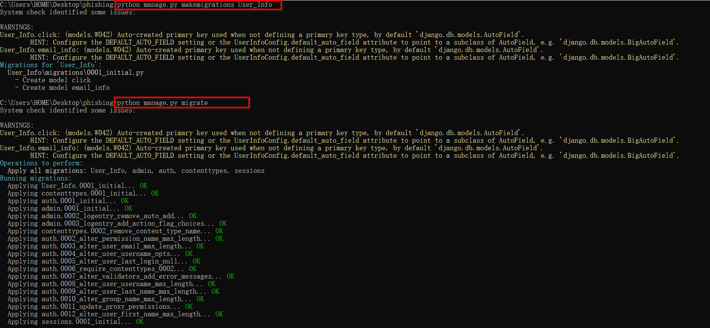
### 1.2、创建后台管理员账号密码：

    python manage.py createsuperuser
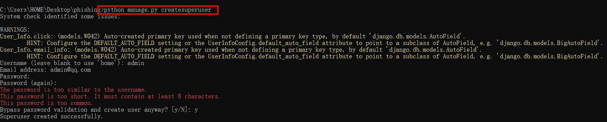

### 1.3、运行
    python manage.py runserver 0.0.0.0:8080 --insecure
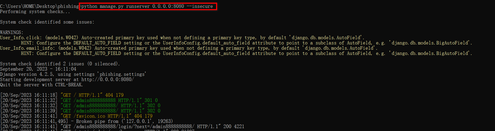
后台登陆：输入刚刚创建的用户名密码

    http://127.0.0.1:8080/admin8888888888/login/?next=/admin8888888888/
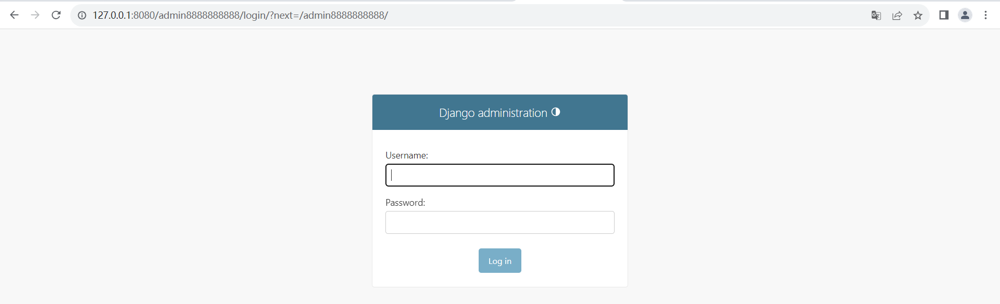
## 2、钓鱼网页
### 2.1、邮件点击率测试
url地址：http://127.0.0.1:8080/click_rate?email=admin@qq.com，将该地址插入钓鱼邮件中，对方点击该邮件，自动打开该链接。
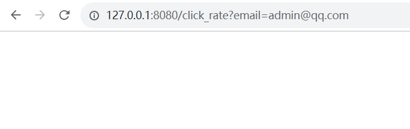
后台统计如下：
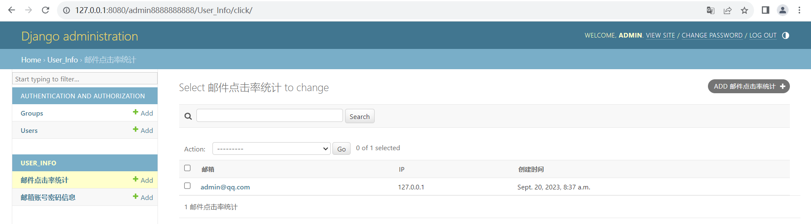
### 2.2、outlook邮箱
访问地址：http://127.0.0.1:8080/outlook_email
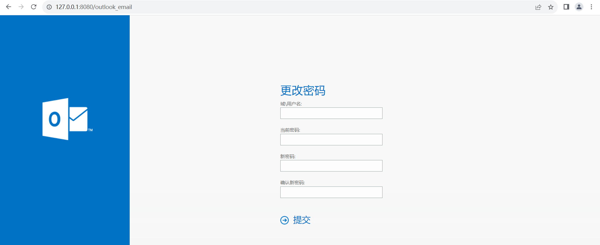
输入账号密码，记录如下：
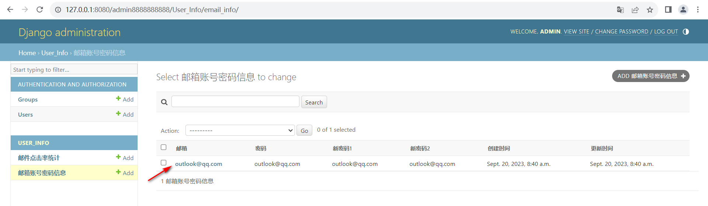

### 2.3、腾讯企业邮箱
访问地址：http://127.0.0.1:8080/tengxun_email
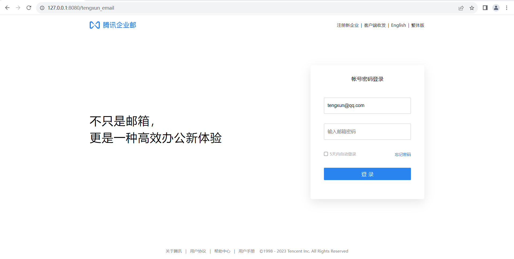
输入账号密码，记录如下：
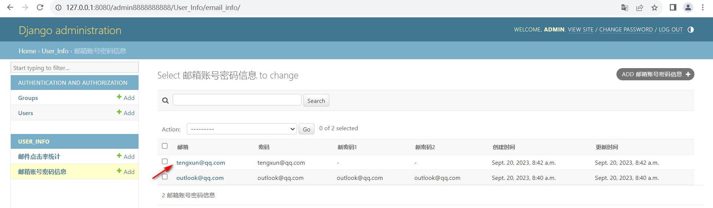file:///C:/Users/HOME/Desktop/phishingEmail/README.md
### 2.4、邮箱系统安全认证
访问地址：http://127.0.0.1:8080/qiye_email
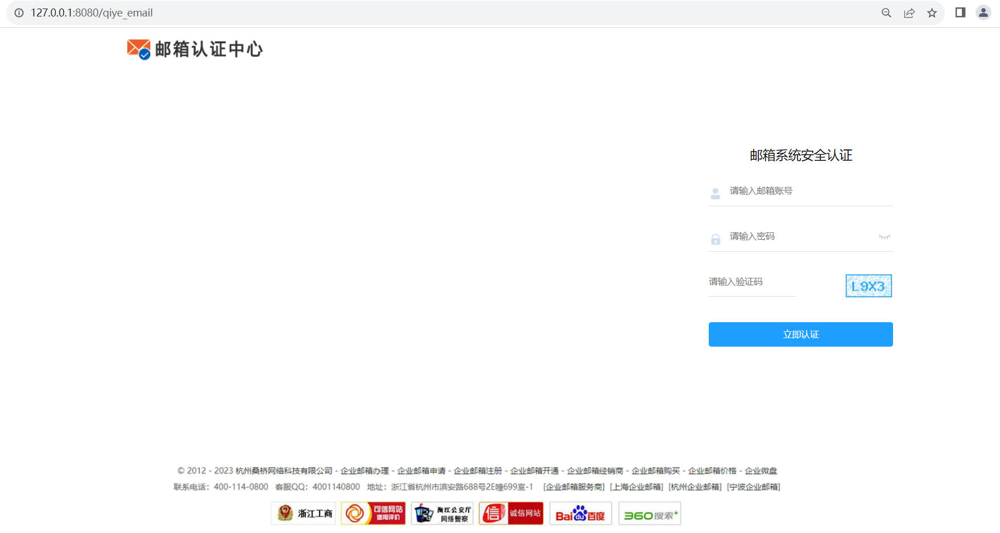
填写密码成功后，显示如下：
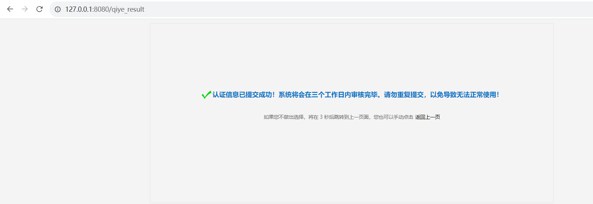
输入账号密码，记录如下：
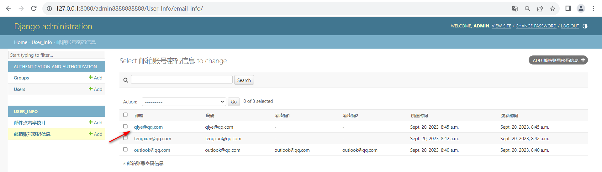
### 免责声明
    本工具仅面向合法授权的企业安全建设行为，如您需要测试本工具的可用性，请自行搭建靶机环境。

    在使用本工具进行检测时，您应确保该行为符合当地的法律法规，并且已经取得了足够的授权。请勿对非授权目标进行扫描和攻击。

    如您在使用本工具的过程中存在任何非法行为，您需自行承担相应后果，作者将不承担任何法律及连带责任。

    在安装并使用本工具前，请您务必审慎阅读、充分理解各条款内容，限制、免责条款或者其他涉及您重大权益的条款可能会以加粗、加下划线等形式提示您重点注意。 除非您已充分阅读、完全理解并接受本协议所有条款，否则，请您不要安装并使用本工具。您的使用行为或者您以其他任何明示或者默示方式表示接受本协议的，即视为您已阅读并同意本协议的约束。

### 安恒-星火实验室

星火实验室专注于实战攻防与研究，研究涉及实战攻防、威胁情报、攻击模拟与威胁分析等，团队成员均来自行业具备多年实战攻防经验的红队、蓝队和紫队专家。本着以攻促防的核心理念，通过落地 ATT&CK 攻防全景知识库，全面构建实战化、常态化、体系化的企业安全建设与运营。